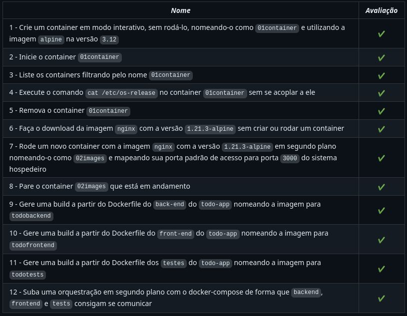

# :open_book: Docker Todo-List :open_book:

 

 

 

# :clipboard: About
O projeto tem como objetivo "Dockerizar" uma aplicação ja feita com Front-End, Back-End e Testes. Na aplicação, foi utilizado o Docker CLI, Docker File e Docker Compose para criar containers nas aplicações 
 

# :hammer_and_wrench: Skills & Tools

- Docker
- Docker Compose
- Docker File

 
